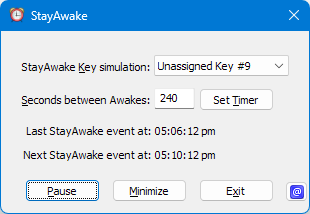
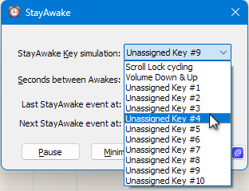

# StayAwake

 &nbsp;&nbsp;&nbsp;&nbsp;&nbsp;

[Current Version: 1.2.0.0](https://github.com/shriprem/StayAwake/blob/main/VersionHistory.md)

StayAwake is a simple utility that enables you to maintain an _Active_ status on Microsoft Teams (and perhaps other messaging applications such as Slack and Zoom). StayAwake also prevents screen saver activation, screen blanking, and Windows session lockouts.

If you are using Microsoft Teams, you may have noticed that Teams automatically sets your status to _Away_ after a certain period of inactivity. This can be frustrating if you are still at your desk but perhaps on a business phone call _OR_ outlining a plan on paper _OR_ consulting some reference material.

StayAwake can be minimized to the Windows System Tray, and will continue to run in the background until you click the _Exit_ button.

StayAwake does its job by simulating key presses of unused or low side-effect buttons at specified time intervals. This is a safe and non-intrusive way to keep your Microsoft Teams status _Active_.

StayAwake executable is now digitally signed by the kind folks at [OSSign](https://ossign.org). Thank you!

## User Interface

#### StayAwake Key simulation list
For most users, the default choice of *Scroll Lock cycling* will work just fine. See the [Key Simulation Options](#key-simulation-options) section below for more info.

#### Seconds between Awakes field
This field allows you to specify the interval between key simulations. The initial default value for this is 240 seconds (_i.e._, 4 minutes). However, you can change this to any value between 10 and 9990 seconds. Your new value will be saved and used the next time you run StayAwake.

#### Set Timer button
After changing the value for *Seconds between Awakes*, click this button to apply the new setting. Clicking this button will also immediately run a StayAwake Key simulation.

The clock times of when the StayAwake event was last run, and when it will do so next are displayed and continually refreshed on the StayAwake window.

#### Pause button
Click this button to pause StayAwake Key simulations.

As seen in the clip above, clicking the *Pause* button will also have these effects:
1. The *PAUSED* state will be indicated in the *Next StayAwake event* time slot.
2. The *Pause* button will change to _Resume_ mode. To exit the *PAUSED* state, click the **Resume** button.
3. If StayAwake is closed while still in paused mode, StayAwake will reopen in paused mode when it is launched the next time. To exit the *PAUSED* state, click the **Resume** button.

   

#### Minimize button
Click this button to minimize StayAwake to the Windows System Tray. See the [SystemTray Icon](#system-tray-icon) section below for more info.

#### Exit button
Click this button to exit StayAwake.

### Key Simulation Options

#### Scroll Lock cycling
This is the default option, and it will work just fine for most users.

However, some users using Remote Desktop alongside have reported spurious keystrokes being transmitted between the connected Windows devices. Users in such situations should explore other key simulation options.

#### Volume Up & Down
With this option, StayAwake will simulate a _Volume Down_ key press, immediately followed by a _Volume Up_ key press, thereby resulting in no net change in volume level.

A minor benefit with this option is the visual feedback. Each StayAwake key simulation event will cause the Windows Volume Slider bar to display for a few seconds above the Windows Taskbar.

However, if a user has muted the audio, then this option will unmute it. Users wishing to avoid this side effect should explore other key simulation options.

#### Unassigned Key (1 to 10)
With these options, StayWake will simulate key press of an unassigned keycode.

These unassigned keycodes have been obtained from this Microsoft article on [Virtual-Key Codes](https://learn.microsoft.com/en-us/windows/win32/inputdev/virtual-key-codes).

Microsoft may start utilizing any of these unassigned codes in the future -- but not all of them in one go. Hence all 10 of the currently unassigned codes have been included in the [StayAwake Key Simulation list](#stayawake--key-simulation-list) so that users can switch to another still available unassigned keycode.

#### Optional Tip
 You can verify StayAwake in action by *temporarily* setting the StayAwake Key simulation selection to [Volume Up & Down](#volume-up--down) and the [Seconds between Awakes](#seconds-between-awakes-field) to 10 seconds.

### System Tray Icon

When you minimize StayAwake, it will be represented by the System Tray icon shown above. You can click on this icon to access the following context menu:

* **Restore**: Click this to restore StayAwake window.

* **Exit**: Click this to exit StayAwake.

## Configuration File Details
StayAwake saves its configuration in a file named `StayAwakeConfig.ini`. This file is co-located in the `StayAwake.exe` application file folder. These key-value pairs are stored in this file:

1. `AwakeKeyCode`: This key stores a numeric value between 0 and 11 to indicate the selection for the [StayAwake Key simulation](#stayawake-key-simulation-list) list.

2. `SecondsBetweenToggles`: This key stores the number of seconds between each StayAwake Key simulation as specified in the [Seconds between Awakes](#seconds-between-awakes-field) field.

   The `TimerIntervalInSeconds` value must be an integer between 10 and 9990. Values outside this range will be ignored and the default value of 240 seconds will be used instead.

3. `AwakePaused`: This key stores a flag value (_Y_ or _N_) to indicate if StayAwake is in paused state.

4. `MultipleInstancesAllowed`: This key stores a flag value (_Y_ or _N_) to indicate whether multiple instances of StayAwake are allowed to run simultaneously. The default value is _N_ (i.e., multiple instances are not allowed). Any value that is not _Y_ will be interpreted as _N_.

## Alternatives

### StayAwake plugin for Notepad++
StayAwake is also available as a [plugin for Notepad++](https://github.com/shriprem/StayAwake_NPP_Plugin). This version can be useful if you have Notepad++ open during your typical workday. You will be spared the need to separately run the standalone StayAwake application.

### Adobe PDF Full screen hack
If you are only looking for a way to block screen saver activation and session lockouts, you do not actually need StayAwake. Instead, you can simply open a PDF document in full screen mode in Adobe Acrobat (Reader | Professional), and leave it open in the background. This will prevent your screen saver from activating, and also prevent your Windows session from locking out.

**Note**: Full screen mode is different than maximized window state. To view a PDF document in full screen mode in Adobe Acrobat (Reader | Professional), either use:
* The menu option: *View » Full screen mode*
* Or the much quicker keyboard shortcut: *Ctrl + L*.

However, if you are looking for a way to keep your Microsoft Teams status _Active_, then StayAwake is the right tool for you.

## Installation

StayAwake is a portable application and does NOT require installation with administrator privileges. Simply download the latest release from the [Releases](https://github.com/shriprem/StayAwake/releases) page and unzip the contents to a folder of your choice. Run the `StayAwake.exe` application file to start the utility.

